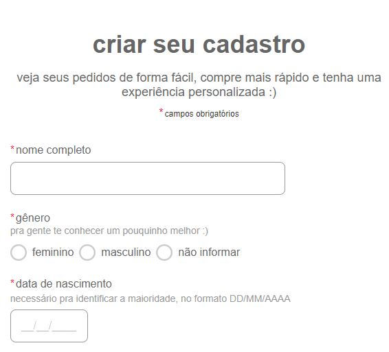

# form-CadEcommerce

### Pesquisa foi realizada com objetivo de criar um Formulario de Cadrasto

## Sites ultilizados

[&lt;SHEIN&gt;](https://br.shein.com/user/index)

 </a>

* Número de celular ou E-mail

* Endereço de E-mail

* Senha

* Preferência

* Número de celular

* Código de Verificação

[&lt;AMERICANAS&gt;](https://cliente.americanas.com.br/minha-conta/cadastro)

</a>

* Nome completo

* Gênero

(feminino, masculino ou não informar)

* Data de nascimento

(necessário pra identificar a maioridade, no formato DD/MM/AAAA)

* CPF

(necessário pra emissão das Notas Fiscais)

* Dados de Endereço

* Telefone

(caso a gente precise entrar em contato sobre seus pedidos)

* E-mail

(informe um e-mail válido. Você vai precisar ativar sua conta depois de criar seu cadastro)

* Senha
(precisa ter entre 6 e 20 caracteres.

[&lt;AMAZON&gt;]()

 </a>

 * Nome

* E-mail

* Senha

* Confirmação de senha

* Código de E-mail

* Telefone

* CEP

* Ocupação

